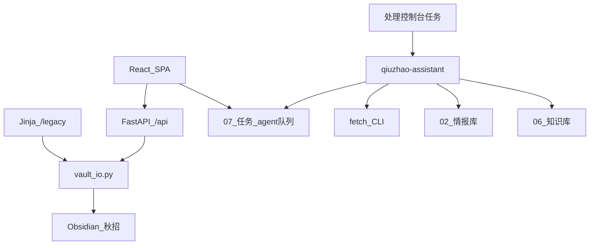

# 秋招助手 · 开发文档

## 架构（混合模式）

| 层 | 组件 | 职责 |
| --- | --- | --- |
| 日常 UI | `qiuzhao/web/` React SPA + `qiuzhao/console/` FastAPI | 职位/投递/日历/复盘 CRUD；Agent 入队 |
| 旧版 UI | `/legacy/*` Jinja 页 | 迁移期保留 |
| 真相源 | Obsidian `秋招/` Markdown | 情报 / 进度 / 知识 / 面经 / 任务 |
| Agent | Cursor + `qiuzhao-assistant` | 消费 `07_任务/agent队列.md`；深挖 JD |
| 共享 IO | `qiuzhao/scripts/vault_io.py` | 控制台与 Skill 共用读写 |
| 抓取 | `qiuzhao/scripts/fetch_*.py` | HTTP / Playwright |

### 启动

| 场景 | 入口 | 地址 |
| --- | --- | --- |
| 日常成品 | 桌面 `Qiuzhao-Console` / `start-console.bat` | http://127.0.0.1:8765（dist；API `--reload`） |
| 改 SPA / 联调 | 桌面 `Qiuzhao-Console-Dev` / `start-console-dev.bat` / `dev.ps1` | http://127.0.0.1:5173（Vite HMR）+ API :8765 `--reload` |

```powershell
$env:QIUZHAO_VAULT="E:\obsidian\My_docs"
# 生产：先构建 SPA，再单端口服务
cd qiuzhao\web; npm install; npm run build
qiuzhao\console\run.ps1
# → http://127.0.0.1:8765 （SPA）· /legacy （旧版）· /api/docs

# 开发：清端口 + API --reload + Vite HMR，浏览器打开 :5173/jobs
qiuzhao\console\dev.ps1

# 刷新桌面快捷方式（Prod + Dev）
qiuzhao\console\create-desktop-shortcut.ps1
```

前端热更新请用 Dev 入口；生产 `dist` 改代码后仍需 `npm run build` 再刷新。

### SPA 五主界面

| 路由 | 数据 | 能力 |
| --- | --- | --- |
| `/jobs` | `02_情报库` | 在招/已截止 Tab、按公司分页、截止优先排序、详情、跟进、核实入队 |
| `/applications` | `05_投递进度` | 状态 Tab、流程 Stepper、PATCH 写回 |
| `/events` | `10_校园活动` | 宣讲/双选列表、立即刷新就业网、公众号补录入队 |
| `/calendar` | 进度时间 + 情报截止 + 校园活动 | 月历、近期日程、冲突、ICS |
| `/review` | `03_面经` + 公司题库 | 题目编辑、题库勾选、总结写回 |
| `/more` | 队列 / 学习 / health | 入队、学习任务、旧版入口 |

### JSON API

前缀 `/api`：`health` / `intel` / `progress` / `calendar` / `events` / `review` / `agent` / `profile`。详见 `/api/docs`。

`GET /api/events`：校园宣讲/双选；`POST /api/events/refresh` 跑就业网抓取；`POST /api/events/inbox` 入队公众号补录。

`GET /api/intel` 支持：

| 参数 | 说明 |
| --- | --- |
| `page` / `page_size` | 分页；`group=company` 时按**公司**分页 |
| `group` | `company` 按公司聚拢；空为扁平岗列表 |
| `scope` | `active`（默认，在招）/ `closed`（已截止）/ `all`；已截止卡可物理在 `02_情报库/_归档/{公司}/`，**不删除** |
| `sort` | `deadline_then_score`（默认：剩余天数升序，再匹配分）/ `score_desc` / `deadline_asc` |
| 筛选 | `q` `plan` `tier` `role_family` `hiring_status` `apply_priority` `deadline` `min_score` |

返回 `total` / `pages` / `stats`：`hiring`（在招岗数）/ `closed`（已截止岗数，含 `_归档`）/ `followed` / `urgent`（在招且本周截止）/ `tiers`（在招档次）。条目可带 `archived`。公司行 `earliest_deadline` 在招只看剩余≥0 天，避免过期岗把公司顶到最前。

批量归档：`vault_io.archive_closed_intel()`（按截止日/状态扫描 → 标「已截止」→ 挪到 `_归档/{公司}/`）。`list_intel()` 默认跳过归档，不占在招库存。

公司多源投递：`vault_io.upsert_company_apply_channel(公司, url=..., code=...)` 写入 `_公司.md` 的 `投递渠道`；列表/详情返回 `apply_channels` / `referral_url` / `referral_code` / `delivery_record_url`；跟进投递预填进度卡内推码与「投递记录查询」。`set_company_delivery_record_url` 专门写入官网申请进度页。

「我的秋招」邮箱跳转：`MailboxBar` + `lib/mailbox.ts`；收件箱 URL 存浏览器 `localStorage`（`qiuzhao.mailbox.v1`），不写 Obsidian。详情可按公司名深链搜 Gmail/Outlook。

### SPA 主题

默认壁纸：`qiuzhao/web/public/theme-bg.jpg` + 浅紫蓝薄罩；顶栏/卡片等为半透明毛玻璃。替换同名文件即可换壁纸（Dev 热更新或 `npm run build`）。

### 数据层

| 层 | 路径 | type | 用途 |
| --- | --- | --- | --- |
| 情报 | `秋招/02_情报库/` | `qiuzhao-intel-job` | JD、链接、匹配（助手）；已截止可进 `_归档/` |
| 公司概况 | `秋招/02_情报库/{公司}/_公司.md` | `qiuzhao-intel-company` | 校招门户、限投、**投递渠道**（官网/HR内推/员工内推，可多条） |
| 校园活动 | `秋招/10_校园活动/` | `qiuzhao-campus-event` | 宣讲会/双选会/组团招聘 |
| 进度 | `秋招/05_投递进度/` | `qiuzhao-progress` | 状态、时间（用户·控制台） |
| 面经 | `秋招/03_面经/` | `qiuzhao-mianshi` | 个人复盘（SPA 可写） |
| 知识 | `秋招/06_知识库/` | `qiuzhao-knowledge` | 外部资料（助手） |
| 学习 | `秋招/07_任务/学习/` | `qiuzhao-study-task` | 面经/手撕任务（控制台） |
| 队列 | `秋招/07_任务/agent队列.md` | `qiuzhao-agent-queue` | Agent 待办 |

旧 `qiuzhao-application` / `02_投递` 已废弃；ICS 脚本仍兼容遗留文件。



## 用户口令（对外仅 3 句）

1. `处理控制台任务` — 消费队列
2. 聊天贴 URL — 快捷入库
3. `每日情报更新` — 日更（或控制台「请求日更」入队）

## 口令接口契约

**主意图（Agent）**

| 意图 | 输入 | 产出 |
| --- | --- | --- |
| 处理控制台任务 | `处理控制台任务` / `消费队列` | 消费 `agent队列.md` 待处理行并回写结果 |
| 链接入库 | 聊天裸 URL，或 `处理收件箱`（表格只填 URL，类型可空） | 先判页面类型；岗位→情报卡 / 知识→知识卡 |
| 导入汇总表 | `导入汇总表 <URL>`；或 OfferStar / 求职方舟 / sma-wiki 裸链 | 读表筛线索 → **深挖 JD** → 过关才写情报（不自动进度） |
| 收集公司 | `每日情报更新` / `刷新情报` | 收件箱+来源库+优先公司日更 |
| `收集秋招 <公司>` / 自然语言搜校招 | 情报卡 + 候选池 + 日志（不自动进度） |
| 跟进投递 | `加入投递表` | 进度行 + 面经壳（若无）+ 双向链接 |
| 面经图片 | `处理面经图片` / `入库图片`；或贴图 | `_inbox_images/{公司}/` → 公司题库（仅 `#类型`+编号问题列表）+ 手撕写入 `高频手撕清单.md`（禁单题卡）+ 主题卡；溯源 `_已处理`；回链 `03_面经`；图归档 `_raw/images/` |

**兼容别名**：`提取岗位` / `入库知识` / `入库粘贴` / `核实情报` / `处理岗位收件箱` / `处理知识收件箱` / `入库图片` / `处理面经图片` 等，见 Skill。

**页面类型**：`单岗` / `汇总表` / `列表待深挖` / `二维码墙`（见 Skill）。

**入库质量门（强制）**：无实质 JD 不入库；微信公众号/扫码墙投递链丢弃；汇总表/牛客日程行本身不写情报卡，必须经官网深挖拿到 JD；截止未知不编造；抓取失败不写空笔记；写入前须 `clean_jd_text.py` 去重标题/元数据/重复 JD 段；官网 0 岗或过期届别 FAQ 且无当期 JD → 删卡不留占位；**提前批与正式批可分卡并存**；**博士硬门槛不入库**（画像硕士；`jd_edu_gate.py`：只要博士则剔除；硕士或博士 / 硕士及以上 / 博士优先仍收）。

助手必须：跑质量门；同来源 URL 去重更新；**禁止**要求用户把裸 URL 改成 `类型: 岗位 \| url:` 硬编码行。

## fetch_url.py

```powershell
$env:QIUZHAO_VAULT = "E:\obsidian\My_docs"
pip install -r qiuzhao\scripts\requirements.txt
python qiuzhao\scripts\fetch_url.py --url "https://..." --out raw.json
```

**JSON 契约**

| 字段 | 说明 |
| --- | --- |
| `url` / `final_url` / `title` / `fetched_at` | 元信息 |
| `text` / `markdown` | 清洗后正文 |
| `status` | `ok` \| `blocked` \| `empty` \| `error` |
| `http_status` / `content_length` / `error` | 诊断 |

退出码：`0` = ok，`2` = 非 ok（仍输出 JSON）。

回退：非 ok → Playwright MCP 或收件箱标「需登录/人工粘贴」。

## fetch_offerstar.py

OfferStar 校招汇总表结构化抓取（首屏 HTTP；多页优先 Playwright 翻页）。

```powershell
python qiuzhao\scripts\fetch_offerstar.py --url "https://www.offerstar.cn/recruitment?channel=校招&title=2027&positions=agent" --out agent.json
python qiuzhao\scripts\fetch_offerstar.py --url "https://www.offerstar.cn/recruitment?channel=校招&title=2027&positions=ai" --out ai.json --filter-keywords "Agent,AI Agent,Agent开发,大模型应用"
```

**JSON 契约**：`url` / `fetched_at` / `status` / `rows[]`，每行含 `公司` / `标题` / `批次` / `更新时间` / `招聘岗位` / `工作地点` / `行业` / `招聘类型` / `截止时间` / `投递链接`。

可选依赖：`playwright`（多页翻全表）。无 Playwright 时 `status=ok_partial`，仅首屏。

**注意**：OfferStar 列表行仅为线索；按质量门须再深挖官网 JD 才可写入 `02_情报库`。

## fetch_fangzhou.py

求职方舟校招汇总表（SPA）：Playwright 打开页面后读取 `localStorage.campus`，按 `urlType=官网` 过滤并去掉微信投递链。

```powershell
python qiuzhao\scripts\fetch_fangzhou.py --out fangzhou.json
python qiuzhao\scripts\fetch_fangzhou.py --out agent.json --filter-keywords "Agent,智能体,Agent开发,大模型应用" --limit 30
```

**JSON 契约**：`url` / `fetched_at` / `status` / `mode` / `row_count` / `rows[]`，每行含 `id` / `公司` / `职位摘要` / `地点` / `截止` / `批次` / `行业` / `urlType` / `投递链接` / `公告链接`。

必选依赖：`playwright`（`playwright install chromium`）。

**浏览器路径**：Cursor Agent 可能注入空的 `PLAYWRIGHT_BROWSERS_PATH`（`cursor-sandbox-cache/...`）。`fetch_fangzhou.py` / `fetch_offerstar.py` / `fetch_sma_wiki.py` 启动前会经 `playwright_env.ensure_playwright_browsers_path()` 回退到 `%LOCALAPPDATA%\ms-playwright`。若仍 launch 失败，再执行：

```powershell
py -3.12 -m playwright install chromium
```

深挖：对筛选行的 `投递链接` 用 `fetch_url` / Playwright 抽具体岗 JD；默认每批至多 10 家；抽不到 JD 则跳过并记来源日志。

## fetch_sma_wiki.py

[sma-wiki 27届校园招聘信息汇总](https://campus.sma-wiki.cn/campus/campus_recruit.html?channel=zpdt)（牛客侧常见入口）：Playwright 打开后读取页面全局 `RAW_DATA`。

默认过滤：`行业`含「互联网」+ `批次`含「27届秋招」；默认剔除微信投递链；自动解开牛客 `jump?url=` 跳转。

```powershell
python qiuzhao\scripts\fetch_sma_wiki.py --out sma_wiki.json --diff-vault
python qiuzhao\scripts\fetch_sma_wiki.py --out agent.json --filter-keywords "Agent,智能体,Agent开发,大模型应用" --limit 50
```

**JSON 契约**：`url` / `fetched_at` / `status` / `mode=playwright_raw_data` / `total_raw` / `row_count` / `rows[]`（`公司` / `职位摘要` / `地点` / `投递链接` / `公告链接` / …）。`--diff-vault` 额外写出 `gap.missing[]`（相对 `02_情报库` 未入库线索）。

**注意**：汇总行仅为线索；按质量门须再深挖官网 JD 才可写入 `02_情报库`。每日情报更新应把本源与方舟/OfferStar 并列。

## fetch_nowcoder_schedule.py

牛客校招日程（`np-api/u/school-schedule/list-card`）：

| batch | 含义 | `招聘计划` |
| --- | --- | --- |
| 1203 | 27提前批 | 校招提前批 |
| 1206 | 27秋招 | 校招正式批 |
| 1210 | 27届秋招 | 校招正式批 |

```powershell
py -3.12 qiuzhao\scripts\fetch_nowcoder_schedule.py --batch 1203,1206,1210 --update-source-links

## fetch_xidian_events.py

西电就业网宣讲会 / 招聘会（双选、组团）：

```powershell
py -3.12 qiuzhao\scripts\fetch_xidian_events.py --write-vault --update-source-links --out qiuzhao\tmp\xidian_events.json
# 仅首页 SSR（无 Playwright）
py -3.12 qiuzhao\scripts\fetch_xidian_events.py --http-only --out qiuzhao\tmp\xidian_home.json
```

写入 `秋招/10_校园活动/`（`type: qiuzhao-campus-event`）。控制台 `POST /api/events/refresh` 与 `schedule-events-refresh.ps1` 同款。

公众号周报：`04_情报/宣讲会收件箱.md` 或 `_inbox_images/宣讲会/` + 队列意图 `宣讲会补录`。
```

输出：`qiuzhao/tmp/nowcoder_filtered.json` + `nowcoder_{batch}.json`。字段含 `公司` / `投递链接` / `批次标签` / `招聘计划` / `网申开始|结束`。微信投递链过滤；白名单 + 关键词筛。列表行须再官网深挖 JD。

## 来源链接库

- 人读：`秋招/04_情报/来源链接库.md`
- 机读：`qiuzhao/data/source_links.json`
- 口令：`检查来源链接`（只更新状态/最近检查）

## 情报卡字段

| 键 | 说明 |
| --- | --- |
| 公司 / 岗位 / 城市 | 基础 |
| 公司档次 | **仅** 大厂 / 中厂 / 小厂 / 央国企 / **外企**；查表 `qiuzhao/data/company_tiers.json` |
| 岗位族 | Agent / 算法 / 研发应用 / 后端 / 前端 / 其他 |
| 招聘状态 | 热招中 / 将截止 / 已截止 / 未开招 / 待核实 |
| 投递优先级 | 练手优先 / 冲刺 / 保底 / 观望 |
| 招聘计划 | 校招提前批 / 正式批 / 人才计划… |
| 匹配分 | 0–100 |
| 投递链接 / 岗位简介 / 信息来源 / 来源链接 | 必填追溯。`岗位简介` 还须写入正文 `## 岗位简介`（阅读视图不展示 YAML） |
| 要求技能 / 已具备 / 待补齐 | 列表 |
| 开放日 / 投递截止 | 日期；未知不编造 |
| 核实于 / 信息时效 / 需再核实 | 时效治理 |

`GET /api/intel` 支持 `tier` / `role_family` / `hiring_status` / `apply_priority`（逗号多选）与 `sort=deadline_asc|score_desc`；SPA「练手视图」= 中厂+小厂 + 练手优先 + 截止升序。`PATCH /api/intel/{stem}` 可改分类字段。

### 提取岗位 / 收集秋招（对齐质量门）

1. 给定 URL：先 `fetch_url`，再抽字段；`投递链接` 优先用户 URL  
2. 给公司名：先找官网校招入口，再按岗位入口同等提取  
3. 无截止 → `信息时效: 待核实` + `需再核实: true`；**禁止编造**  
4. 二次平台 → 标待核实  
5. 写入四轴分类字段；中厂/小厂练手池不得只因非大厂跳过；外企/央国企不得因非国内互联网跳过  
6. 写 `04_情报/来源日志.md`

## 进度卡字段

| 键 | Obsidian 类型建议 | 枚举 |
| --- | --- | --- |
| 公司 / 岗位 | Text 或 List | 可手输；联想自情报 |
| 招聘计划 | List | 校招正式批 / 校招提前批 / 人才计划 / 实习 / 其他 |
| 投递状态 | List | 待投 / 待测评 / 待笔试 / 待面试-一面 / 待面试-二面 / 待面试-三面 / 待面试-HR面 / 等结果 / Offer / 已拒 / 弃投 |
| 优先级 | List | 🔴 明星攻坚 / 🟡 重点储备 / 🟠 机会窗口 / ⚪ 观察池 |
| 结果 | List | 进行中 / Offer / 已拒 / 待定 |
| 投递时间 / 测评时间 / 笔试时间 / 一面 / 二面 / 三面 / HR面 | Date & time | |
| 内推人 / 内推码 / 投递链接 / **投递记录查询** / 备注 | Text | 投递记录查询＝官网个人中心申请进度页；公司 SSOT 在 `_公司.md`，跟进时预填 |
| 关联情报 / 关联面经 | Text（wikilink） | |
| 排序权重 | Number | |

### Bases 属性类型设置

1. 打开 `秋招/01_看板/_属性枚举参考.md`
2. Obsidian → **设置 → 属性**
3. 状态类 → **List**；时间类 → **Date & time**

## 知识卡字段

| 键 | 说明 |
| --- | --- |
| 标题 / 主题 / 子主题 | 主题：Agent / 手撕与算法 / 系统设计 / 公司面经 / 博客与长文 |
| 来源链接 / 来源类型 | 博客 / 面经站 / 面经截图 / 官方文档 / 其他 |
| 关联公司 / 关联岗位 | 公司面经必填关联公司 |
| 掌握度 | 未学 / 浏览 / 可讲 / 已掌握 |
| 待归类 | bool；不确定主题时 true |
| 抓取于 / 更新于 | |

路径：`秋招/06_知识库/{主题目录}/`；索引 **`06_知识库/00_索引.md`**（旧 `_索引` 仅作跳转）；全文可选 `_raw/`；面经图收件箱 `_inbox_images/{公司}/`，归档 `_raw/images/{公司}/`。
文件夹首页：`02_情报库/_索引.md`、`05_投递进度/_索引.md`、`03_面经/_索引.md`。

## Bases

文件：`秋招/01_看板/秋招投递.base` → 只过滤 `05_投递进度`。  
`groupBy` 必须为 object。

## Dataview 时间

```dataview
dateformat(笔试时间, "yyyy-MM-dd HH:mm") AS "笔试时间"
```

## CSS

`.obsidian/snippets/qiuzhao-dashboard.css`；启用片段 `qiuzhao-dashboard`。

## ICS

```powershell
$env:QIUZHAO_VAULT = "E:\obsidian\My_docs"
python qiuzhao\scripts\export_ics.py
```

## vault_dual_backup.py（强制 · 防 E 盘损坏）

E: 机械盘随时可能坏。**任何** vault 干净写入后必须推远程：

```powershell
python qiuzhao\scripts\vault_dual_backup.py -m "简短说明"
```

| 路径 | 角色 |
| --- | --- |
| `E:\obsidian` | 主工作副本（`.git` 可用时在此 commit/push） |
| `D:\backup\my-obsidian-mirror` | 异盘镜像；**E: git 损坏时自动改走此处**同步 `My_docs` → commit → push |
| `https://github.com/Alam-100/my-obsidian.git` | 远程真相备份 |

可选：`--force-mirror` 强制走 D:；`--no-repair-e` 推送后不覆盖 E: `.git`；`--skip-push` 仅从远程拉齐镜像。

## 情报可靠性约定

- 来源优先级：官网 > 官方公众号 > 二次平台（标待核实）
- 必填：投递链接、来源链接、核实于、岗位简介
- `核实于` >14 天 → `需再核实: true`
- 不编造截止日；抓取/检索写入 `来源日志.md` 与收件箱处理结果

## 真实信息验收门（跑真数前对照）

用于后续「指定公司 / 广搜 / 用户给链接」真实招聘链路的反复验证：

1. **来源**：官网 > 官方渠道 > 二次平台；后者情报卡必须 `信息时效: 待核实` 且 `需再核实: true`
2. **实质 JD**：每条情报 frontmatter `岗位简介` **以及**正文 `## 岗位简介` 须含职责/要求正文（阅读视图不展示 YAML）；仅岗位名列表 → **不入库**（或标 `信息时效: 缺JD` 降级）。漏写正文时：`py -3.12 qiuzhao/scripts/sync_intel_body_jd.py`
3. **字段齐全**：`投递链接`、`来源链接`、`核实于`、`信息时效`、`岗位简介`；投递链不得为微信公众号/扫码墙；岗卡必须单岗 permalink（北森 `/campus/jobs?jobAdId=` 须改 `/campus/detail?jobAdId=`），列表+内推码只进 `_公司.md`
4. **抓取链路**：汇总表 CLI → 官网深挖 → `fetch_url.py` → 非 ok 则 Playwright → 再失败则停；**禁止**空笔记冒充成功
5. **截止日**：未知则留空 + 待核实；**禁止编造**确定日期
6. **去重**：同投递/来源 URL 更新合并，不平行复制主笔记
7. **抽样复核**：同一公司隔日执行「核实情报」，对比 JD/截止/链接是否漂移并记入来源日志
8. **进度隔离**：收集/提取不得自动建 `05_投递进度`；仅「加入投递表」建行

## 已知限制

- **日常入口是本机控制台**（`qiuzhao/console`，127.0.0.1:8765）；Cursor 只消费 Agent 队列与复杂深挖
- 控制台不代替爬虫：入队后仍需开 Cursor 说 `处理控制台任务`
- 登录墙/强反爬需人工粘贴或 Playwright 登录态（不破解）
- 求职方舟：须 Playwright 读 localStorage；官网筛后仍多为门户列表，须二次深挖 JD
- 牛客日程：HTTP `list-card` 可用；多为公司级线索 + `customWangshenLink`，须二次深挖 JD；提前批/正式批分 batch
- OfferStar：HTTP 翻页可用，但多为公众号链；按质量门默认不当有效投递源
- 腾讯文档 smartsheet 需 Playwright 或用户导出 xlsx
- 面经截图：`处理面经图片` / 控制台入队；Cursor 读图，不另建 OCR 服务；题库只出问题列表；手撕只进高频清单
- Obsidian List 下拉依赖属性类型 + 历史取值联想；表格内 `_` 路径须用 `[[path|别名]]`
- Cursor Automation 日更见 `AUTOMATION_DRAFT.md`（默认未开）

## 改库约定

1. 更新笔记 `更新于`
2. 追加 `秋招/修改日志.md` 与仓库 `CHANGELOG.md`
3. work 仓库 git commit
4. 用户主文档：`秋招/文件夹与职责说明.md`
